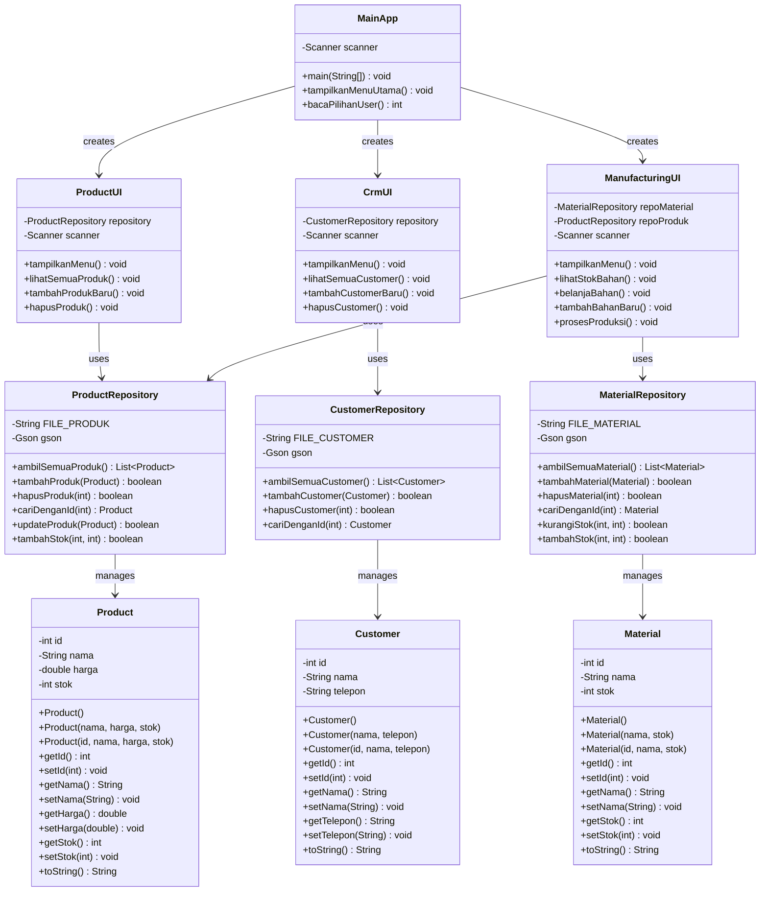

```mermaid
classDiagram
    %% Model Layer
    class Product {
        -int id
        -String nama
        -double harga
        -int stok
        +Product()
        +Product(nama, harga, stok)
        +Product(id, nama, harga, stok)
        +getId() int
        +setId(int) void
        +getNama() String
        +setNama(String) void
        +getHarga() double
        +setHarga(double) void
        +getStok() int
        +setStok(int) void
        +toString() String
    }

    class Customer {
        -int id
        -String nama
        -String telepon
        +Customer()
        +Customer(nama, telepon)
        +Customer(id, nama, telepon)
        +getId() int
        +setId(int) void
        +getNama() String
        +setNama(String) void
        +getTelepon() String
        +setTelepon(String) void
        +toString() String
    }

    class Material {
        -int id
        -String nama
        -int stok
        +Material()
        +Material(nama, stok)
        +Material(id, nama, stok)
        +getId() int
        +setId(int) void
        +getNama() String
        +setNama(String) void
        +getStok() int
        +setStok(int) void
        +toString() String
    }

    %% Repository Layer
    class ProductRepository {
        -String FILE_PRODUK
        -Gson gson
        +ambilSemuaProduk() List~Product~
        +tambahProduk(Product) boolean
        +hapusProduk(int) boolean
        +cariDenganId(int) Product
        +updateProduk(Product) boolean
        +tambahStok(int, int) boolean
    }

    class CustomerRepository {
        -String FILE_CUSTOMER
        -Gson gson
        +ambilSemuaCustomer() List~Customer~
        +tambahCustomer(Customer) boolean
        +hapusCustomer(int) boolean
        +cariDenganId(int) Customer
    }

    class MaterialRepository {
        -String FILE_MATERIAL
        -Gson gson
        +ambilSemuaMaterial() List~Material~
        +tambahMaterial(Material) boolean
        +hapusMaterial(int) boolean
        +cariDenganId(int) Material
        +kurangiStok(int, int) boolean
        +tambahStok(int, int) boolean
    }

    %% UI Layer
    class ProductUI {
        -ProductRepository repository
        -Scanner scanner
        +tampilkanMenu() void
        +lihatSemuaProduk() void
        +tambahProdukBaru() void
        +hapusProduk() void
    }

    class CrmUI {
        -CustomerRepository repository
        -Scanner scanner
        +tampilkanMenu() void
        +lihatSemuaCustomer() void
        +tambahCustomerBaru() void
        +hapusCustomer() void
    }

    class ManufacturingUI {
        -MaterialRepository repoMaterial
        -ProductRepository repoProduk
        -Scanner scanner
        +tampilkanMenu() void
        +lihatStokBahan() void
        +belanjaBahan() void
        +tambahBahanBaru() void
        +prosesProduksi() void
    }

    %% Main Entry Point
    class MainApp {
        -Scanner scanner
        +main(String[]) void
        +tampilkanMenuUtama() void
        +bacaPilihanUser() int
    }

    %% Relationships
    ProductRepository --> Product : manages
    CustomerRepository --> Customer : manages
    MaterialRepository --> Material : manages
    
    ProductUI --> ProductRepository : uses
    CrmUI --> CustomerRepository : uses
    ManufacturingUI --> MaterialRepository : uses
    ManufacturingUI --> ProductRepository : uses
    
    MainApp --> ProductUI : creates
    MainApp --> CrmUI : creates
    MainApp --> ManufacturingUI : creates
```
