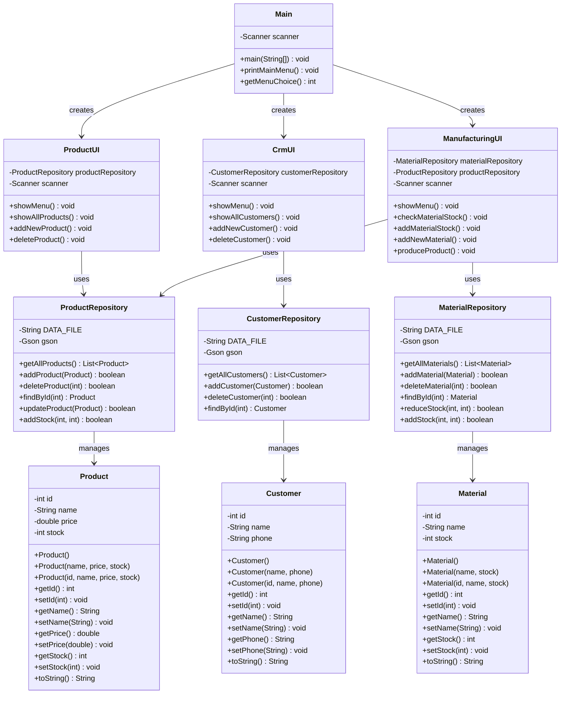

```mermaid
classDiagram
    %% Model Layer
    class Product {
        -int id
        -String name
        -double price
        -int stock
        +Product()
        +Product(name, price, stock)
        +Product(id, name, price, stock)
        +getId() int
        +setId(int) void
        +getName() String
        +setName(String) void
        +getPrice() double
        +setPrice(double) void
        +getStock() int
        +setStock(int) void
        +toString() String
    }

    class Customer {
        -int id
        -String name
        -String phone
        +Customer()
        +Customer(name, phone)
        +Customer(id, name, phone)
        +getId() int
        +setId(int) void
        +getName() String
        +setName(String) void
        +getPhone() String
        +setPhone(String) void
        +toString() String
    }

    class Material {
        -int id
        -String name
        -int stock
        +Material()
        +Material(name, stock)
        +Material(id, name, stock)
        +getId() int
        +setId(int) void
        +getName() String
        +setName(String) void
        +getStock() int
        +setStock(int) void
        +toString() String
    }

    %% Repository Layer
    class ProductRepository {
        -String DATA_FILE
        -Gson gson
        +getAllProducts() List~Product~
        +addProduct(Product) boolean
        +deleteProduct(int) boolean
        +findById(int) Product
        +updateProduct(Product) boolean
        +addStock(int, int) boolean
    }

    class CustomerRepository {
        -String DATA_FILE
        -Gson gson
        +getAllCustomers() List~Customer~
        +addCustomer(Customer) boolean
        +deleteCustomer(int) boolean
        +findById(int) Customer
    }

    class MaterialRepository {
        -String DATA_FILE
        -Gson gson
        +getAllMaterials() List~Material~
        +addMaterial(Material) boolean
        +deleteMaterial(int) boolean
        +findById(int) Material
        +reduceStock(int, int) boolean
        +addStock(int, int) boolean
    }

    %% UI Layer
    class ProductUI {
        -ProductRepository productRepository
        -Scanner scanner
        +showMenu() void
        +showAllProducts() void
        +addNewProduct() void
        +deleteProduct() void
    }

    class CrmUI {
        -CustomerRepository customerRepository
        -Scanner scanner
        +showMenu() void
        +showAllCustomers() void
        +addNewCustomer() void
        +deleteCustomer() void
    }

    class ManufacturingUI {
        -MaterialRepository materialRepository
        -ProductRepository productRepository
        -Scanner scanner
        +showMenu() void
        +checkMaterialStock() void
        +addMaterialStock() void
        +addNewMaterial() void
        +produceProduct() void
    }

    %% Main
    class Main {
        -Scanner scanner
        +main(String[]) void
        +printMainMenu() void
        +getMenuChoice() int
    }

    %% Relationships
    ProductRepository --> Product : manages
    CustomerRepository --> Customer : manages
    MaterialRepository --> Material : manages
    
    ProductUI --> ProductRepository : uses
    CrmUI --> CustomerRepository : uses
    ManufacturingUI --> MaterialRepository : uses
    ManufacturingUI --> ProductRepository : uses
    
    Main --> ProductUI : creates
    Main --> CrmUI : creates
    Main --> ManufacturingUI : creates
```
